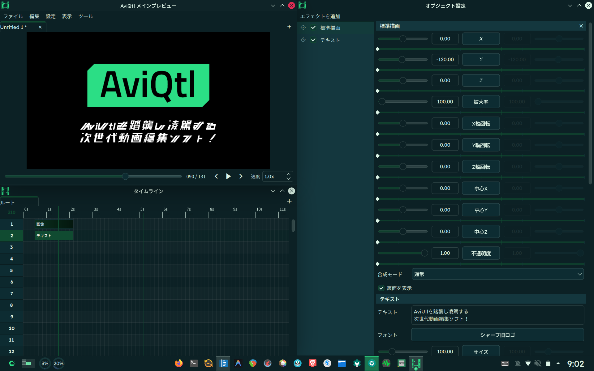

<p align="center">
  
</p>

<p align="center"><b>AviUtlを踏襲し凌駕する次世代動画編集ソフト</b></p>

<p align="center">
  <a href="https://aviqtl.taisho-guy.org">AviQtlのお部屋</a>
  / <a href="https://codeberg.org/taisho-guy/AviQtl">Codebergリポジトリ</a>
  / <a href="https://github.com/taisho-guy/AviQtl">GitHubミラー</a>
  / <a href="https://codeberg.org/taisho-guy/AviQtl/releases">リリース</a>
  / <a href="https://codeberg.org/taisho-guy/AviQtl/wiki/Home">Wiki</a>
</p>

## AviQtlとは

**AviUtl 1.10**及び**ExEdit 0.92**の面影を残しつつ、より安全・高速・強力・自由な動画編集ソフトを開発するプロジェクトです。クロスプラットフォームなAviUtlクローンの開発を通じ、AviUtlを「仕方なく」使う方々の最適解になることを目指しております。

### 開発目的

- 安全：完全に挙動を予測できる堅牢性
- 高速：GPUを主軸に捉えた効率的な処理
- 強力：あらゆる方法を駆使できる柔軟性
- 自由：無料、オープンソース、透明性の高い開発形態

### 開発目標

- [x] 自由ライセンス且つ無料
- [ ] AviUtlに酷似したUI
- [ ] VST3やLV2等の音声エフェクトのホスト
- [ ] Linux、Windows、macOSにネイティブ対応
- [ ] Vulkan、Metal、DirectX12によるゼロコピーGPUエフェクト
- [ ] ECSアーキテクチャによるデータ指向設計
- [ ] FFmpegによるリアルタイムHWデコード

### AviQtl Legacyとの違い

| 違い | 旧AviQtl | 新AviQtl |
| --- | --- | --- |
| 描画エンジン | Qt Quick | bgfx |
| GUIフレームワーク | Qt QML | Qt Widgets / SDL3 |

Qt QuickベースではCompute Shaderへの対応や完全なECSアーキテクチャの実装が困難でしたから、新しい技術基盤で再出発しました。[AviQtl Legacy](https://codeberg.org/taisho-guy/AviQtl/src/branch/legacy)や[AviQtl-Plus](https://github.com/GT-610/AviQtl-Plus)とは異なるプロジェクトです。

## インストール方法

AviQtlは現在ビルドをリリースしておりません。[AviQtl Legacy](https://codeberg.org/taisho-guy/AviQtl/releases/tag/0.0.95-Unstable)か[AviQtl-Plus](https://github.com/GT-610/AviQtl-Plus/releases)をお試し下さい。

## 開発計画

詳細なロードマップは作成しておりませんが、主に、AviQtl Legacyからの移植とbgfxによるレンダリングエンジンの実装に分けられます。

### AviQtl Legacyから移植されるもの
- GUIの構成
- コア（デコーダー、音声プラグインホスト等）

### 新規に実装するもの
- bgfxのレンダリングパイプライン
- 純粋なECS

## 技術アーキテクチャ

AviQtlは、モダンなC++とマルチスレッドアーキテクチャを採用し、動画編集における高いパフォーマンスと拡張性を実現しています。

### システム構成

- **UI層 (Qt Widgets):** アプリケーションのメインフレームワークとして機能し、ユーザーインターフェースとウィンドウ管理を担当します。
- **レンダリング層 (bgfx + SDL3):** プレビュー描画には `bgfx` を採用し、プラットフォーム固有のグラフィクスAPI（Vulkan, Metal, DX12）を抽象化しています。ウィンドウの生成とイベントハンドリングには `SDL3` を利用し、クロスプラットフォームでの安定した動作を実現しています。
- **実行層 (スレッド駆動):** レンダリング処理はメインのUIスレッドから分離された専用スレッド (`PreviewRenderThread`) で実行され、重い描画処理がUIの応答性に影響を与えない設計となっています。

### 主要な処理フロー

1. **起動:** `app/boot/main.cpp` が起点となり、SDL3を初期化した後、Qtアプリケーションを開始します。
2. **ウィンドウ管理:** `WindowCoordinator` がプレビューウィンドウを管理し、`SdlPreviewSurface` を通じてプラットフォーム固有のネイティブハンドル（HWND, NSWindow, Wayland Surfaceなど）をレンダリング層へ供給します。
3. **レンダリングループ:** レンダリング専用スレッドがシーク要求やリサイズ要求を待機・処理し、bgfxを通じてGPUへ描画コマンドを送信します。この非同期設計により、タイムライン操作の滑らかさを維持します。

### ディレクトリ構成

```text
app/
 ├── boot/         # エントリポイントとアプリケーション初期化
 ├── platform/     # OS依存処理（SDL3連携・ネイティブハンドル取得）
 ├── render/       # レンダリングエンジン（bgfx連携・レンダリングスレッド）
 ├── runtime/      # アプリケーションの実行時管理（ウィンドウ管理など）
 └── ui/           # ユーザーインターフェースの実装
```

## 貢献

AviQtlは現在コアを実装しております。一貫性を高め、私が望むアーキテクチャを正しく構築する為に、コアが安定するまではプルリクエストをお受けできません。質問がございましたらイシューよりお申し付け下さい。

## Q & A

<details>
<summary>開発リセットの理由</summary>

旧来のAviQtl Legacyは、Compute Shaderへの対応と、完全なECSアーキテクチャの構築、という観点において、技術的な制約がございました。これは採用技術によるものでしたから、回避するには技術基盤を変更し、再び0から再実装する必要がありました。

</details>

<details>
<summary>AviUtlを使わずにわざわざAviQtlを開発する理由</summary>

- AviUtlはWindows上でのみ動作するから
- AviUtlは自由ソフトウェアでないから

私は絶対にLinux上のAviUtl（ライクな動画編集ソフト）で音MADを作りたいと考えております。これは、私が歩んできた道を辿れば必然のこととして理解できます。

| いつ | 起きたこと |
| --- | --- |
| 小学 | Scratch上で「[RED_ZONE.exeが本気を出したみたいです](https://www.nicovideo.jp/watch/sm21191000)」の[再現](https://scratch.mit.edu/projects/50033810/)に出会う。人生初の音MAD。当時はWindowsが好きだった。 |
| 中学 | Windows11へのアップデートを強行的に行ったものの、パフォーマンス上の問題に直面した。仕方なくLinuxに移行したところ、すっかり魅了された。最終的にCachyOSに定住するように。 |
| 高1 | 新しいPCを買い与えられ、念願の音MAD制作を開始。デュアルブートで頻繁にブートローダーが壊れた為、Wineへの移行を試みた、がAviUtlは期待通りには動かなかった。「代替ソフト」とされるものを複数試したが、満足できずにいた。 |
| 高2 | Windows環境を立ち上げるのが嫌になり、探究活動で動画編集ソフトの開発を決行するも失敗。Rust言語でeguiとbevyをベースに実装する予定だった。年度末にC++とQtで再チャレンジを開始。 |
| 高3 | Qtのエコシステムのおかげで、僅か数ヶ月で形に。しかし、技術的限界も浮き彫りに。やむを得ず開発をリセットし、今に至る。 |

音MADとLinuxは私の青春そのものです。AviQtlの開発は私の青春の集大成と言えます。

</details>

<details>
<summary>機能少ない。バグだらけ。使いにくい。開発目標はどうなってんだよ。</summary>

ご期待にお答えできず、申し訳ございません。AviQtlは開発初期段階です。私はできる限り早く実装を進めております。AviQtlに対する不満を具体化して、イシューを作成していただければ、開発に大いに役立ちます。また、もしC++がお得意であれば、ソースコードを読んでいただき、イシューでアドバイスして頂けたら嬉しいです。

</details>

<details>
<summary>名称やロゴの由来</summary>

名称は「AviUtl」と「Qt」を組み合わせた造語です。
ロゴも、AviUtlとQtのロゴを組み合わせたデザインになっています。

<p align="center">
   +  = 
</p>

</details>


## ライセンス

画像ファイルは [CC0](https://creativecommons.org/publicdomain/zero/1.0/legalcode.txt) に基づいて提供されます。

ソースコードは [GNU Affero General Public License Version 3](https://www.gnu.org/licenses/agpl-3.0.txt) or later に基づいて提供されます。

[Remix Icon](https://remixicon.com/) は [Remix Icon License](https://raw.githubusercontent.com/Remix-Design/RemixIcon/refs/heads/master/License) に基づいて提供されます。これは**自由ライセンスではありません**。

その他のライブラリのライセンスは上記のライセンスと異なる場合がございます。

## AviQtl Legacyについて

<details>
<summary>開発リセットについて</summary>

### AviQtlは2026年5月末日を持って、開発をリセットしました
- 理由は以下のとおりです。
  - Qt Quick独自のレンダリングループとCompute Shaderとの相性が悪く、実装が困難
  - 同様に、ECSとの相性が悪く、最適化が困難
- 旧来のQt QuickベースのAviQtl（以降『AviQtl Legacy』）はコミット履歴を含めて`legacy`ブランチに移動しました。現在の`main`ブランチには、Qt Widgets及びSDL3とbgfxをベースとした新しいAviQtl（以降『AviQtl』）が置かれています。

### AviQtl Legacyによって得られた知見
- QtとFFmpegを使えば、動画編集ソフトの高品質なプロトタイプを高速に実装できる。
- Compute Shaderの開通が難しい為、GPUゼロコピーを目指すならQt Quickベースのプレビュー実装は不適。
- QMLとQSBを用いると、拡張性の高いアーキテクチャを構築できる（少なくともvertとfragは十分に機能する）。

### AviQtlの今後
- 開発リセット直後はコア機能を実装するためプルリクエストをお受けできません。御了承下さい。
- AviQtl Legacyのソースコード及び最終バージョン（AviQtl Legacy 0.0.95）のリリースは、引き続き[GNU Affero General Public License Version 3 or later](https://www.gnu.org/licenses/agpl-3.0.txt)でライセンスされ、公開を続けます。しかし、動画編集ソフトとしての実用性はありません。AviQtl Legacyの今後のアップデートや互換性は保証されません。
- AviQtlのコントリビューターだった[GT-610](https://codeberg.org/GT610)さんが、[AviQtl-Plus](https://github.com/GT-610/AviQtl-Plus)としてAviQtl Legacyの開発を継続されています。もしAviQtl Legacyがお気に召したのであれば、是非AviQtl-Plusをご参照下さい。
- 現在3種のAviQtlが並行して存在します。
  - **AviQtl** : 新しい技術を採用して作り直しているAviQtl。
  - **AviQtl Legacy** : Qt Quickベースの旧AviQtl。今後更新されない。
  - **AviQtl-Plus** : AviQtl Legacyを継続して開発する派生プロジェクト。
</details>

<details>
<summary>AviQtl Legacyとは</summary>

## AviQtl Legacyとは



**AviUtl 1.10** & **ExEdit 0.92**の操作感を踏襲しつつ、**AviUtlを超える性能**を持つ動画編集ソフトを開発するプロジェクトです。

### 主な特徴

- AviUtlに酷似したUI
- GPUを使った**高速で強力なエフェクト**
- VST3やLV2等の**音声エフェクト**に対応
- **Linux**、**Windows**、**macOS**に対応

## インストール手順

1. Linuxの場合、以下の依存関係をインストールします：
   - Qt6全般、LuaJIT、Vulkan実装（Mesa等）、FFmpeg、Carla、libc++
2. [リリースページ](https://codeberg.org/taisho-guy/AviQtl/releases)からお使いのPCに最適なビルドをダウンロードします。
3. ファイルを展開し、`AviQtl` に実行権限を付与して実行します。

> [!NOTE]
> Linuxユーザーの場合、Arch Linux相当の最新環境を要求します。Ubuntu等の他のディストリビューションをご利用の方は、[Distrobox](https://distrobox.it/)でArch Linuxコンテナを作成し、その中でAviQtlを実行することを強く推奨致します。

## ビルド手順

`BUILD.py` は現在の OS からビルドターゲットを自動判定します。通常は `python BUILD.py` だけで実行できますが、手動で指定することも可能です。

共通の準備として、リポジトリをクローンし、必要に応じて仮想環境を作成してください。

```bash
git clone https://codeberg.org/taisho-guy/AviQtl.git
cd AviQtl

# pipでPySide6を用意する場合（推奨）
python3 -m venv .venv
# Linux/macOS/MSYS2: source .venv/bin/activate
# Windows/PowerShell: .venv\Scripts\Activate.ps1
python -m pip install --upgrade pip PySide6
```

<details>
<summary>Linux</summary>

Linux では既定で distrobox/podman コンテナを使用してビルド環境を分離します。

1. **依存関係のインストール**
   - Pacman: `sudo pacman -S --needed distrobox podman python pyside6 git`
   - APT: `sudo apt install distrobox podman python3 python3-pyside6 git`
   - DNF: `sudo dnf install distrobox podman python3 python3-pyside6 git`
2. **ビルド**
   - `python BUILD.py --arch`
3. **実行**
   - `./build/AviQtl`
</details>

<details>
<summary>macOS</summary>

macOS では `BUILD.py` が Homebrew 経由で CMake、Ninja、Qt6 等の依存関係を確認・インストールし、`macdeployqt` と `codesign` を実行して `.app` バンドルを作成します。

1. **依存関係のインストール**
   - `brew install python pyside git`
2. **ビルド**
   - `python BUILD.py --xcode`
3. **実行**
   - `open ./build/AviQtl.app`
</details>

<details>
<summary>Windows (MSYS2)</summary>

1. **依存関係のインストール**
   - `pacman -S git mingw-w64-ucrt-x86_64-pyside6`
2. **ビルド**
   - `python BUILD.py --msys2`
3. **実行**
   - `./build/AviQtl.exe`
</details>

<details>
<summary>Windows (MSVC - 非推奨)</summary>

MSVC ビルドは環境構築の複雑さから非推奨としています。

1. **追加の準備**
   - Visual Studio 2022 Build Tools の C++ ツールセット
   - 公式 Qt の MSVC x64 版（例: `msvc2022_64`）
   - vcpkg（`VCPKG_ROOT` 環境変数で指定可能。見つからない場合は `BUILD.py` が取得を試みます）
2. **ビルド**
   - `python BUILD.py --msvc --qt-dir <Qtインストールディレクトリ>`
   - `--qt-dir` を省略した場合は `QT_MSVC_DIR` 等から自動検出を試みます。
3. **実行**
   - `.\build\AviQtl.exe`
</details>

## Q & A

<details>
<summary>開発のきっかけは？</summary>

### OSの壁
LinuxでAviUtlが動かないことがきっかけです。**AviUtlのためだけにWindows環境を維持し続けること**は受け入れがたいものでした。

### 肥大化したエコシステム
理由は違えど、AviUtlを「仕方なく」使い続けている方は少なくないはずです。長年の拡張によって肥大化した「ハウルの動く城」のようなエコシステムは、不満を抱えながらも手放しにくい存在となっています。

### プロジェクトの目標とミッション
[鹿児島県立甲南高等学校](https://edunet002.synapse-blog.jp/konan/)の課題研究において、この課題を解決すべくAviQtlの独自開発を決意しました。

- **個人的な目標:** Domino、VocalShifter、REAPER、AviUtlをはしごすることなく、Linux上のAviQtlのみで音MADを制作すること。
- **AviQtlのミッション:** AviUtlを「仕方なく」使っている方々の最適解になること。
</details>

<details>
<summary>なぜAviUtlのクローンを開発しているのですか？</summary>

AviQtlは「AviUtlの再発明」ではありません。AviUtlを強く意識していますが、その中身は全く異なります。

| 項目 | AviQtl | ExEdit0 | ExEdit2 |
| :--- | :--- | :--- | :--- |
| 基盤技術 | Qt6 | Win32 API | Win32 API |
| 並列処理モデル | データ駆動型（ECS） | シングルスレッド | マルチスレッド |
| メモリ空間 | 64bit | 32bit (最大4GB) | 64bit |
| プレビュー描画 | Vulkan / Metal / DX12 | GDI | DX11 |
| 音声エンジン | Carla (VST3/LV2等) | 標準機能のみ | 標準機能のみ |
| プラグイン方式 | LuaJIT / C++ / QML / GLSL | Lua / C++ | LuaJIT / C++ |
| 対応OS | Linux, Windows, macOS | Windows | Windows |

AviQtlは構造的な弱点を根本的に解決します：
1. **ECS（Entity Component System）によるデータ指向:** CPUキャッシュ効率を極限まで高め、大量のオブジェクト処理を高速化。
2. **近代的なメモリ管理:** C++23のスマートポインタを採用し、原因不明のクラッシュを構造的に最小化。
3. **UIとレンダリングの分離:** 重い描画中でもタイムライン操作が妨げられず、High-DPI環境でもUIが鮮明に表示されます。
</details>

<details>
<summary>名称やアイコンの由来は？</summary>

名称は「AviUtl」と「Qt」を組み合わせた造語です。
アイコンは、QtとAviUtlのロゴを組み合わせたデザインになっています。

<p align="center">
   +  = 
</p>
</details>

<details>
<summary>AviUtlのプラグインは使えますか？</summary>
いいえ。仕組みが異なるため互換性は有りません。互換レイヤーを実装する予定も有りません。
</details>

## 関連リンク

AviQtlは、多くの素晴らしいプロジェクトの上に成り立っています。

| プロジェクト | ライセンス | 役割 |
| :--- | :--- | :--- |
| AviUtl | 非自由 | リスペクト元 |
| Carla | GPLv2+ | 音声エフェクト（VST3/LV2等）のホスト |
| FFmpeg | GPLv2+ | 動画・音声のデコード / エンコード |
| LuaJIT | MIT | 高速なスクリプトエンジン |
| Qt | GPLv3 | UI/UXフレームワーク |
| Zrythm | AGPLv3 | 音声プラグイン実装の参考 |
| Remix Icon | Remix Icon License | シンボルアイコン |

## ライセンス

AviQtlは[GNU Affero General Public License](https://www.gnu.org/licenses/agpl-3.0.txt)に基づいて公開されています。

AviQtl内で使用されている[Remix Icon](https://remixicon.com/)は[Remix Icon License](https://raw.githubusercontent.com/Remix-Design/RemixIcon/refs/heads/master/License)に基づいて提供されています。

</details>


 